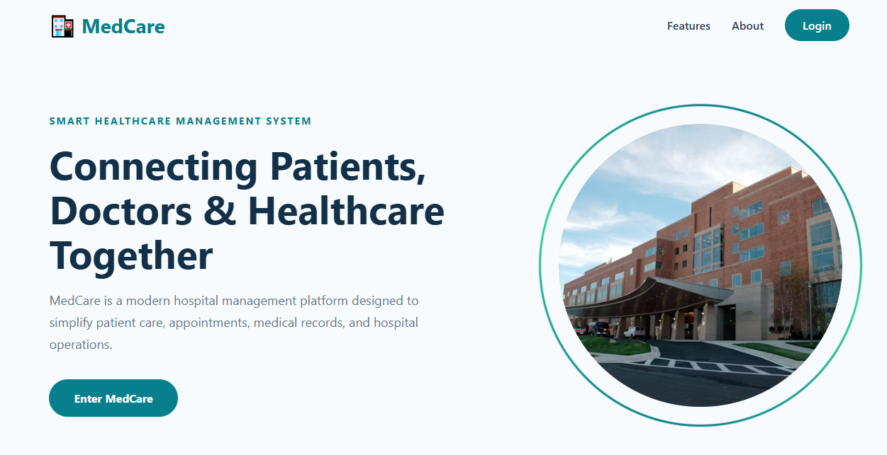
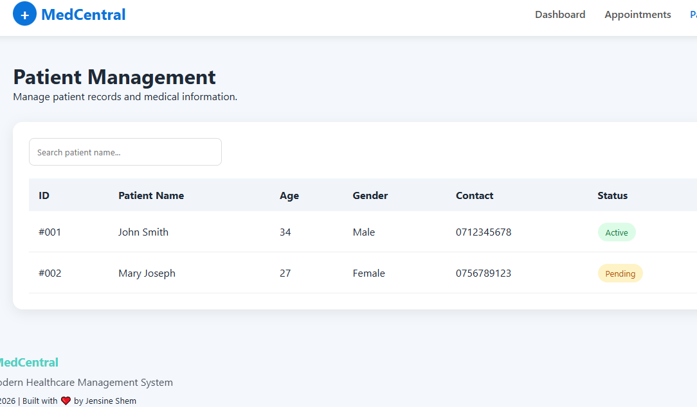
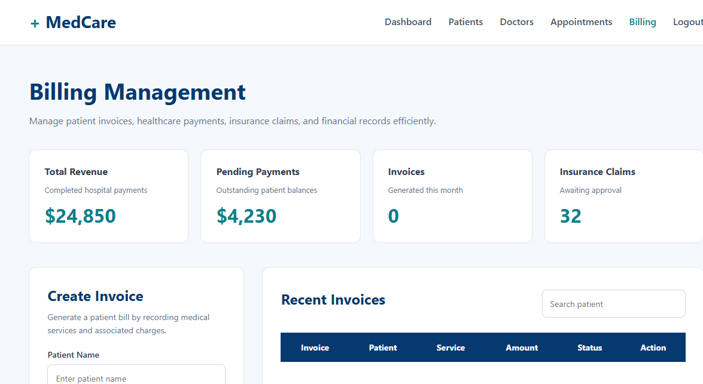

# 🏥 MedCentral — Healthcare Management Platform UI

## Overview

MedCentral is a modern healthcare management web application prototype designed to demonstrate how digital platforms can simplify hospital workflows.

The project focuses on creating a clean, intuitive, and responsive user experience for managing essential healthcare operations such as patient information, doctor profiles, appointments, billing, and administrative tasks.

Built as a frontend application, MedCentral showcases the design and development of a scalable healthcare system interface with a focus on usability, accessibility, and professional UI/UX principles.

---

## ✨ Features

### 🔐 Authentication Interface
- Professional login experience
- Forgot password interface
- User access flow simulation

### 📊 Dashboard
- Healthcare overview statistics
- Quick navigation to important modules
- Organized administrative layout

### 👥 Patient Management
- Patient information display
- Patient record interface
- Structured healthcare data presentation

### 👨‍⚕️ Doctor Management
- Doctor profiles
- Department organization
- Healthcare staff overview

### 📅 Appointment Management
- Appointment scheduling interface
- Status tracking
- Organized appointment records

### 💳 Billing Management
- Invoice management interface
- Payment tracking layout
- Professional billing workflow design

### ⚙️ Settings
- User preference management interface
- Account customization layout

---

## 🛠️ Technologies Used

| Technology | Purpose |
|------------|---------|
| HTML5 | Application structure |
| CSS3 | Styling, layouts, and responsive design |
| JavaScript | Interactivity and dynamic behavior |

---

## 🎯 Project Goals

The goal of MedCentral was to explore how frontend technologies can be used to build professional healthcare software interfaces that are:

- User-friendly
- Responsive across devices
- Easy to navigate
- Visually consistent
- Designed around real-world workflows

---

## 📸 Screenshots

### Dashboard

### Patient Management

### Billing

---

## 🚀 Future Improvements

Future versions of MedCentral can include:

- Backend integration using Flask, Spring Boot, or Node.js
- Database integration for patient records
- Secure authentication and authorization
- Real-time appointment management
- Role-based access for doctors, patients, and administrators
- API integration

---

## 📂 Project Structure
